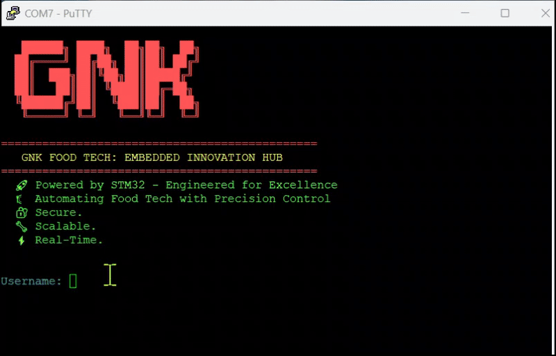

# STM32 FreeRTOS Embedded System Project

## 🚀 Project Overview

An advanced embedded system built on **STM32F767ZI Nucleo** board featuring a custom shell interface, sensor monitoring, flash logging, and real-time task management. Designed for food technology applications with precision control and monitoring capabilities.

## 🎥 Video Demonstration



## ✨ Key Features

### 🖥️ Interactive Shell System
- **Secure Login**: Username/password authentication
- **Command Line Interface**: Full-featured shell with command history
- **Tab Completion**: Smart auto-completion for commands
- **Colored Output**: ANSI color-coded terminal interface
- **Line Editing**: Arrow key navigation, backspace, insert mode

### 📊 Sensor Integration
- **Temperature & Humidity**: HDC1080 sensor support (500ms timer)
- **Accelerometer**: ADXL345 3-axis accelerometer (1000ms timer)
- **Real-time Data**: FreeRTOS timer-based automatic sensor readings
- **Data Queuing**: Latest sensor data stored in overwrite queues
- **Tilt Calculation**: Real-time tilt angle computation from accelerometer

### 💾 Flash Data Logging
- **Persistent Storage**: Logs stored in STM32 flash memory (Sector 11)
- **Circular Buffer**: Automatic wrap-around when flash is full
- **Structured Logging**: Tagged log entries with timestamps
- **Log Levels**: INFO, WARN, ERROR with configurable filtering
- **Paginated Reading**: View logs page by page via shell

### 🔧 Hardware Control
- **LED Management**: Multi-color LED control system
- **GPIO Abstraction**: Clean hardware abstraction layer
- **I2C Communication**: Robust sensor communication protocols

### ⚡ Real-Time Features
- **FreeRTOS Tasks**: Multi-threaded shell architecture
- **Software Timers**: Periodic sensor data collection
- **Memory Monitoring**: Heap usage tracking
- **Queue Management**: Latest-data overwrite queues for sensors
- **Thread-Safe Operations**: Mutex-protected shared resources

## 🛠️ Hardware Requirements

- **MCU**: STM32F767ZI Nucleo-144 board
- **Sensors**:
  - HDC1080 Temperature/Humidity sensor (I2C)
  - ADXL345 Accelerometer (I2C)
- **LEDs**: RGB LED connected to GPIOB pins
- **Communication**: UART6 for shell interface

## 📋 Pin Configuration

| Peripheral | Pin | Function |
|------------|-----|----------|
| UART6 | PC6/PC7 | Shell Communication |
| I2C2 | PB10/PB11 | Sensor Bus |
| LED Green | PB0 | Status LED |
| LED Blue | PB7 | Activity LED |
| LED Red | PB14 | Error LED |

## 🔧 Building and Flashing

### Prerequisites
- STM32CubeIDE or compatible toolchain
- STM32CubeMX for configuration
- ST-Link debugger/programmer

### Build Steps
1. Clone the repository
2. Open project in STM32CubeIDE
3. Build the project (`Ctrl+B`)
4. Flash to target board (`F11`)

## 🖱️ Shell Commands

Connect via UART (115200 baud) and log in with:
- **Username**: `root`
- **Password**: `admin`

### Available Commands

| Command | Description | Usage |
|---------|-------------|-------|
| `help` | Show all available commands | `help` |
| `get_sensor` | Read temperature/humidity | `get_sensor` |
| `get_accel` | Read accelerometer data | `get_accel` |
| `led_on` | Turn on LED | `led_on <1\|2\|3>` |
| `led_off` | Turn off LED | `led_off <1\|2\|3>` |
| `log` | Manage flash logs | `log [read\|clear\|page <n>]` |
| `memory_usage` | Show heap information | `memory_usage` |
| `whoami` | Show current user | `whoami` |
| `clear` | Clear terminal screen | `clear` |

## 📊 System Architecture

```
                            ┌────────────────────┐
                            │    Shell Task      │
                            │   (Priority 2)     │
                            │   UART Interface   │
                            └─────────┬──────────┘
                                      │
                    ┌─────────────────┼──────────────────┐
                    │                 │                  │
         ┌──────────▼──────────┐      │       ┌──────────▼──────────┐
         │   Temp/Humidity     │      │       │   Accelerometer     │
         │   Timer (500ms)     │      │       │   Timer (1000ms)    │
         │     HDC1080         │      │       │     ADXL345         │
         └──────────┬──────────┘      │       └──────────┬──────────┘
                    │                 │                  │
         ┌──────────▼──────────┐      │       ┌──────────▼──────────┐
         │  Sensor Queue       │      │       │  Accel Queue        │
         │ (Latest T&H Data)   │      │       │ (Latest XYZ Data)   │
         └──────────┬──────────┘      │       └──────────┬──────────┘
                    │                 │                  │
                    └─────────────────┼──────────────────┘
                                      │
                            ┌─────────▼─────────┐
                            │   FreeRTOS Kernel │
                            │  Timer Service    │
                            │ Queue Management  │
                            └─────────┬─────────┘
                                      │
                    ┌─────────────────┼─────────────────┐
                    │                 │                 │
         ┌──────────▼──────────┐      │      ┌──────────▼──────────┐
         │    UART Driver      │      │      │    I2C Driver       │
         │   (Shell I/O)       │      │      │  HDC1080 + ADXL345  │
         └─────────────────────┘      │      └─────────────────────┘
                                      │
                           ┌──────────▼──────────┐
                           │    GPIO Driver      │
                           │   (RGB LEDs)        │
                           └─────────────────────┘
```

## 📁 Project Structure

```
├── Core/
│   ├── Src/
│   │   ├── main.c              # System initialization
│   │   ├── app_main.c          # Application entry point
│   │   ├── shell.c             # Shell system core
│   │   ├── shell_commands.c    # Command implementations
│   │   ├── shell_extensions.c  # UI extensions
│   │   ├── sensor.c            # Sensor management
│   │   ├── led_control.c       # LED abstraction
│   │   ├── logger.c            # Logging system
│   │   └── logger_flash.c      # Flash storage
│   └── Inc/
│       └── [corresponding headers]
└── Drivers/
    └── [STM32 HAL drivers]
```

## 🎯 Key Features Demo

### 1. Interactive Shell
```bash
root@root> help
Available commands
Function            | Description                     
--------------------|--------------------
led_on              | Turn on the LED                
get_sensor          | Read temperature and humidity  
log                 | Open Log files                 
```

### 2. Sensor Monitoring
```bash
root@root> get_sensor
[INFO] [1234 ms] Temp: 23.45°C, Hum: 45.67%, Time: 1234 ms

root@root> get_accel
[INFO] [1235 ms] Accel x_g: 0.12 y_g: -0.05 z_g: 0.98
```

### 3. Flash Logging
```bash
root@root> log page 0
Log Page 0 (logs 0 to 9 of 25 total)
[INFO] [1000 ms] SYS: System initialized
[WARN] [1500 ms] I2C: Sensor timeout detected
[ERROR] [2000 ms] SENSOR: HDC1080 communication failed
```

## 🔍 Memory Usage

The system efficiently manages memory with:
- **Flash Usage**: ~64KB for application code
- **RAM Usage**: ~32KB including FreeRTOS overhead
- **Heap Monitoring**: Real-time heap usage tracking
- **Stack Protection**: Overflow detection enabled


</div>
